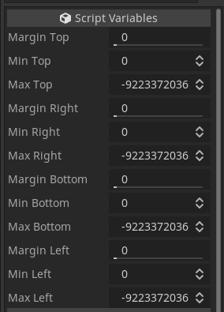
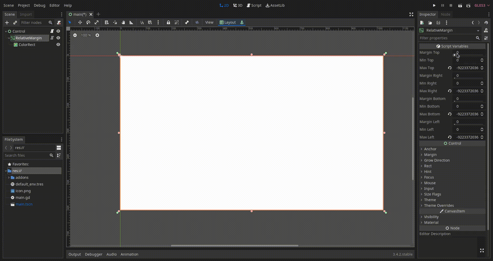

# RelativeMargin

MarginContainer with margin size relative to its own size.  
4 indipendent margins with Min/Max in pixels for each margin.

# Screenshots

[Video example](screenshots/example02.m4v)

# Usage

There are 4 margins and a min/max value for each.  
To disable the min margin, set it to 0.  
To disable the max margin, set it to INF.

# License

[GPLv3](LICENSE)
